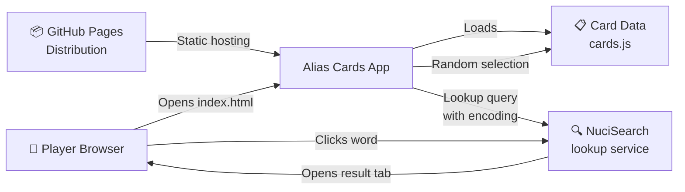
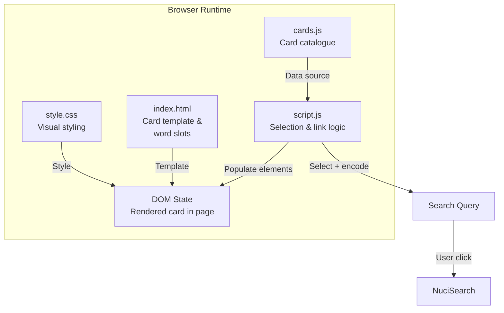
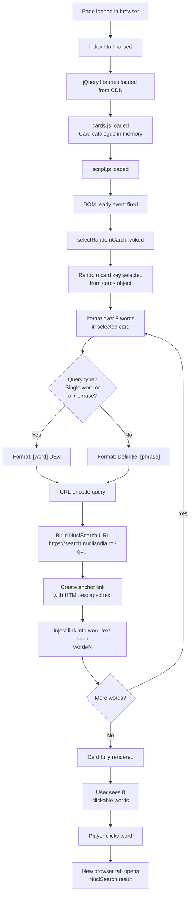
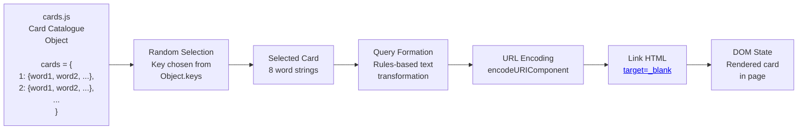

# Alias Cards (ROU) Architecture

This document describes the current architecture of Alias Cards (ROU), a single-page web application for displaying random Alias Party game cards in Romanian with integrated word lookup functionality.

## 📑 Table of Contents

- [Purpose](#purpose)
- [System Context](#system-context)
- [Architectural Style](#architectural-style)
- [Runtime Flow](#runtime-flow)
- [Components](#components)
- [Data Architecture](#data-architecture)
- [Interfaces and Integrations](#interfaces-and-integrations)
- [Cross-Cutting Concerns](#cross-cutting-concerns)

## 🎯 Purpose

This architecture documents a stateless, browser-based single-page application that serves Alias Party game cards to players. The system boundary encompasses all card data, selection logic, UI rendering, and word-lookup integration. The intended audience includes contributors who extend the card catalogue, modify game mechanics, or integrate additional lookup providers. This document records the current implemented architecture rather than a target design.

## 🌐 System Context

The application is a client-side browser runtime with no backend server component. Players initiate card draws via a button in the UI. Each card displays 8 words or phrases that become interactive search links. The application delegates word definition lookups to the external NuciSearch service.

The principal external boundaries are:

- **jQuery Libraries (CDN):** Inbound HTTPS dependency for DOM manipulation and easing animations. Source: `https://cdnjs.cloudflare.com`. Failure to load prevents card rendering.
- **NuciSearch Service:** Outbound HTTPS integration for word and phrase definitions. Queries are URL-encoded and opened in new tabs. Format: `https://search.nucilandia.ro?q=[encoded-query]`. Independent of application logic; player-initiated.
- **GitHub Pages Hosting:** Deployment boundary. Application is served as static content from `https://hmlendea.github.io/alias-cards-rou/`.

## 🏗️ Architectural Style

The application implements a **client-side Model-View-Controller** pattern:

- **Model:** Stateless card catalogue in `cards.js` — a JavaScript object keyed by card number, each containing 8 word/phrase entries.
- **View:** Semantic HTML (`index.html`) defining the card layout and word slots. Styling applied via `style.css`.
- **Controller:** Event-driven logic in `script.js` that selects cards, generates search queries, and populates the DOM.

There is no server-side component, session state, or persistent storage beyond browser DOM. The application is inherently stateless; each page reload triggers a fresh card selection.

The principal architecture boundaries are:

- **Card Data Layer:** `cards.js` owns the card catalogue. All card definitions flow outward; no mutations occur during runtime.
- **Presentation Layer:** `index.html` and `style.css` own the layout and styling. The DOM is stateful; word elements are populated on each card draw.
- **Logic Layer:** `script.js` owns card selection, query formation, link generation, and DOM manipulation. Orchestrates communication between Model and View.
- **External Integration Boundary:** NuciSearch links are user-initiated; the application does not wait for or handle responses.

## 🔄 Runtime Flow

The principal runtime sequence is:

1. **Page Load & Library Initialization:** Browser loads `index.html`, parses the card template with 8 word slots, and fetches jQuery dependencies from CDN.
2. **Data Injection:** `cards.js` is parsed and the `cards` object is available in global scope.
3. **DOM Ready & Card Selection:** Once the DOM is ready, `selectRandomCard()` is invoked. A random card is selected from the `cards` object using `Math.floor(Math.random() * keys.length)`.
4. **Query Formation & Link Generation:** For each of the 8 words in the selected card:
   - The word is inspected: if it is a single word OR a two-word phrase starting with "a" (infinitive), it is formatted as `[word] DEX`.
   - All other multi-word phrases are formatted as `Definiție: [phrase]`.
   - The query is URL-encoded and appended to the NuciSearch base URL.
   - The word text is HTML-escaped to prevent injection and wrapped in an `<a>` element with `target="_blank"` and `rel="noopener noreferrer"`.
5. **DOM Injection:** The link is injected into the corresponding `word-text` span (e.g., `#word1 .word-text`).
6. **User Interaction:** Player clicks a word; the browser opens the NuciSearch result in a new tab.

## 🧩 Components

| Component | Responsibility | Principal Dependencies | Lifetime or Ownership |
|-----------|----------------|------------------------|-----------------------|
| `index.html` | Semantic card template, 8 word slots, UI structure, refresh button | None | Static HTML; loaded once per page |
| `style.css` | Visual styling, card appearance, word layout, animations, responsive design | `index.html` | Loaded once per page; stateless |
| `cards.js` | Card catalogue data — object mapping card IDs to 8-word sets | None (pure data) | Loaded once per page; immutable at runtime |
| `script.js` | Card selection logic, query formation, link encoding, DOM manipulation | `cards.js`, jQuery, DOM API | Loaded once per page; `selectRandomCard()` invoked on ready and refresh |
| jQuery (CDN) | DOM manipulation, event handling, animation easing | External HTTPS dependency | Loaded from CDN; global scope |

## 💾 Data Architecture

The application owns a single canonical data source: the card catalogue. No server-side state, caching, or persistence exists. The catalogue is immutable; all transformations are ephemeral and occur in the browser memory.

| Data or Store | Owner | Representation and Storage | Lifecycle or Consistency |
|---------------|-------|----------------------------|--------------------------|
| Card Catalogue | `cards.js` module | JavaScript object: `{ cardId: { word1: string, word2: string, ..., word8: string }, ... }` | Immutable; loaded at parse time; persists for page lifetime. No server sync, no caching policy. |
| Selected Card | `selectRandomCard()` function | Local variable; random key selected from catalogue keys. | Created on page load and on each refresh. Not persisted; lost on page reload. |
| Word Queries | `selectRandomCard()` function during iteration | String: formatted according to rules (`[word] DEX` or `Definiție: [phrase]`). URL-encoded for transmission. | Ephemeral; generated per-render; not cached. |
| Rendered DOM | Browser DOM | HTML anchor elements injected into `#wordN .word-text` spans. | Created per card render; updated on each refresh; lost on page reload. No localStorage or cookies. |

## 🔌 Interfaces and Integrations

| Interface or Integration | Direction | Contract | Owner | Failure Semantics |
|--------------------------|-----------|----------|-------|-------------------|
| jQuery (HTTPS CDN) | Inbound | `https://cdnjs.cloudflare.com/ajax/libs/jquery/3.6.3/jquery.min.js` and jQuery Easing module. Provides `$()`, event handling, DOM manipulation, and animation easing. | `script.js` | If CDN is unreachable or timeout occurs, jQuery is undefined; subsequent `$()` calls in `selectRandomCard()` fail silently or throw. Card rendering is blocked. No fallback. |
| NuciSearch Lookup Service | Outbound (user-initiated) | Player-opened tabs link to `https://search.nucilandia.ro?q=[encoded-query]`. Query parameter encoding: `encodeURIComponent()`. No API contract; URL-driven. | Player browser; not owned by application | If NuciSearch is down, the new tab displays a 404 or service error. Application logic is unaffected; the failure is visible to the player, not handled by code. |
| GitHub Pages Hosting | Distribution | Static content served from `https://hmlendea.github.io/alias-cards-rou/`. All assets (`*.html`, `*.css`, `*.js`) are fetched over HTTPS. | Repository maintainer | If hosting fails, the entire application is unavailable. No fallback or graceful degradation. |

## 🧵 Cross-Cutting Concerns

### Security and Privacy

- **Input Validation & XSS Prevention:** User input is not accepted directly. Card data originates from the `cards.js` source code, not from external or user-provided sources. Word text is HTML-escaped using jQuery's `$('').text(wordText).html()` pattern before injection into the DOM, preventing script injection if a card entry is maliciously authored.
- **Link Safety:** Anchor elements include `target="_blank"` and `rel="noopener noreferrer"` to prevent the opened tab from accessing `window.opener` and executing arbitrary code in the original page context.
- **No Authentication or Secrets:** No API keys, credentials, or authentication tokens are embedded or transmitted. The application is public and stateless.
- **No Personal Data:** The application does not collect, log, or transmit player data. No cookies, localStorage, or analytics integration is present.

### Error Handling

- **CDN Failure:** If jQuery fails to load, subsequent DOM manipulation in `selectRandomCard()` will throw `ReferenceError: $ is not defined`. The card will not render, and the page will display the static HTML template with placeholder text. No error message or recovery is implemented.
- **Missing Card Data:** If `cards.js` fails to load or is malformed, `selectRandomCard()` will throw `ReferenceError: cards is not defined`. Again, no recovery is implemented.
- **NuciSearch Integration:** Word lookup failures are not handled by the application. If a link is clicked and NuciSearch is unreachable, the browser tab displays a standard HTTP error or NuciSearch's error page. The application does not wait for or validate the response.

### Observability

- **No Logging or Monitoring:** The application does not emit logs, metrics, or traces. No console output is generated during normal operation (browser console is silent).
- **No Analytics:** No tracking, event logging, or user engagement metrics are collected.
- **Debugging:** Developers can use browser DevTools to inspect the card object, examine the generated query URLs, or trace function execution in `script.js`.

### Configuration

| Configuration Area | Source | Responsibility | Override or Secret Policy |
|--------------------|--------|----------------|---------------------------|
| NuciSearch Base URL | Hardcoded in `script.js` | `selectRandomCard()` function constructs URLs using the fixed string `'https://search.nucilandia.ro?q='`. | No environment variable, configuration file, or secret manager. To change the lookup service, `script.js` must be manually edited. |
| Card Catalogue | `cards.js` file | Entire card dataset is defined as a JavaScript object literal. | No database, remote fetch, or dynamic loading. To add or modify cards, `cards.js` must be edited directly. |
| jQuery Version | CDN link in `index.html` | Fixed URL references `jquery@3.6.3` and jQuery Easing. | No version negotiation or fallback CDN. To upgrade jQuery, the `<script>` tag in `index.html` must be updated. |
| Styling | `style.css` file | Visual configuration (colours, fonts, layout) is defined in CSS. | No theme switcher, CSS variables, or CSS-in-JS framework. To customize appearance, `style.css` must be edited. |

### Concurrency and Resource Use

- **Single-Threaded Execution:** All JavaScript code runs on the browser's single main thread. No Web Workers, async tasks, or background processes are present.
- **DOM Manipulation Efficiency:** `selectRandomCard()` iterates over 8 words sequentially, injecting links one at a time. No batch DOM operations or virtual DOM. Re-renders are triggered by user action (refresh button) or on page load; no continuous polling or animations.
- **Memory:** The `cards` object is loaded entirely into memory at parse time. For typical card sets (hundreds to thousands of cards), memory overhead is negligible. No garbage collection or cleanup is required beyond normal browser lifecycle.
- **Network Bandwidth:** All assets are static. jQuery is fetched from CDN on every page load (browser cache may apply). NuciSearch queries are lightweight URL requests; the lookup tab is user-initiated and does not contribute to application overhead.
